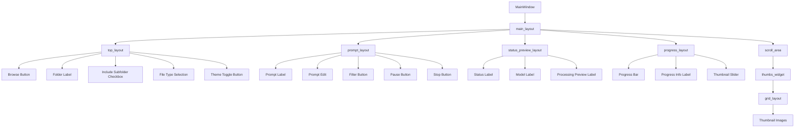

# โครงสร้าง UI ปัจจุบันและที่ต้องการ

## โครงสร้าง UI ปัจจุบัน



## โครงสร้าง UI ที่ต้องการ

```mermaid
graph TD
    A[MainWindow] --> B[main_layout]
    B --> C[top_layout]
    B --> D[prompt_layout]
    B --> E[status_preview_layout]
    B --> F[progress_layout]
    B --> G[scroll_area]
    
    C --> C1[Browse Button]
    C --> C2[Folder Label]
    C --> C3[Include Subfolder Checkbox]
    C --> C4[File Type Selection]
    C --> C5[Theme Toggle Button]
    
    D --> D1[Prompt Label]
    D --> D2[Prompt Edit]
    D --> D3[Filter Button]
    D --> D4[Pause Button]
    D --> D5[Stop Button]
    
    E --> E1[Status Label]
    E --> E2[Model Label]
    E --> E3[Processing Preview Label]
    
    F --> F1[Progress Bar]
    F --> F2[Progress Info Label]
    
    G --> G1[thumbs_widget]
    G1 --> G2[grid_layout]
    G1 --> G4[slider_layout]
    G2 --> G3[Thumbnail Images]
    G4 --> G5[Thumbnail Slider]